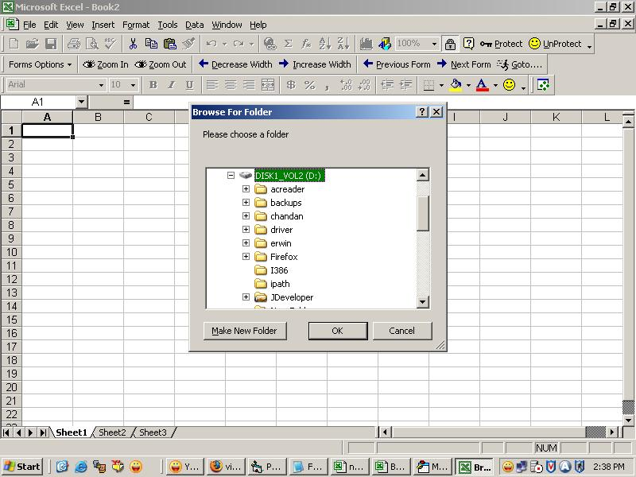

<div align="center">

## Browse Folder without API reference in Word, Excel in VBA


</div>

### Description

This is a sample code to Open Folder Browsing Windows in Word and Excel. user need not to include any special reference or API code for this purpose.
 
### More Info
 
Function returns the absolute path of the folder

no side effect


<span>             |<span>
---                |---
**Submitted On**   |
**By**             |[Chandan Banga](https://github.com/Planet-Source-Code/PSCIndex/blob/master/ByAuthor/chandan-banga.md)
**Level**          |Intermediate
**User Rating**    |4.8 (24 globes from 5 users)
**Compatibility**  |VBA MS Excel
**Category**       |[Microsoft Office Apps/VBA](https://github.com/Planet-Source-Code/PSCIndex/blob/master/ByCategory/microsoft-office-apps-vba__1-42.md)
**World**          |[Visual Basic](https://github.com/Planet-Source-Code/PSCIndex/blob/master/ByWorld/visual-basic.md)
**Archive File**   |[](https://github.com/Planet-Source-Code/chandan-banga-browse-folder-without-api-reference-in-word-excel-in-vba__1-60433/archive/master.zip)


### Source Code

```
Function BrowseFolder(Optional OpenAt As Variant) As Variant
  Dim ShellApplication As Object
  Set ShellApplication = CreateObject("Shell.Application").BrowseForFolder(0, "Please choose a folder", 0, OpenAt)
  On Error Resume Next
  BrowseFolder = ShellApplication.self.Path
  Set ShellApplication = Nothing
  Select Case Mid(BrowseFolder, 2, 1)
    Case Is = ":"
      If Left(BrowseFolder, 1) = ":" Then GoTo err1
    Case Is = "\"
      If Not Left(BrowseFolder, 1) = "\" Then GoTo err1
    Case Else
      GoTo err1
  End Select
 Exit Function
err1:
  BrowseFolder = False
End Function
Sub OpenFolder()
  Dim Response As Variant
  Response = BrowseFolder
  If Response = False Then
    MsgBox "You have selected Invalid Folder", vbInformation
  Else
    MsgBox "Selected Folder - " & Response, vbInformation
  End If
End Sub
```

